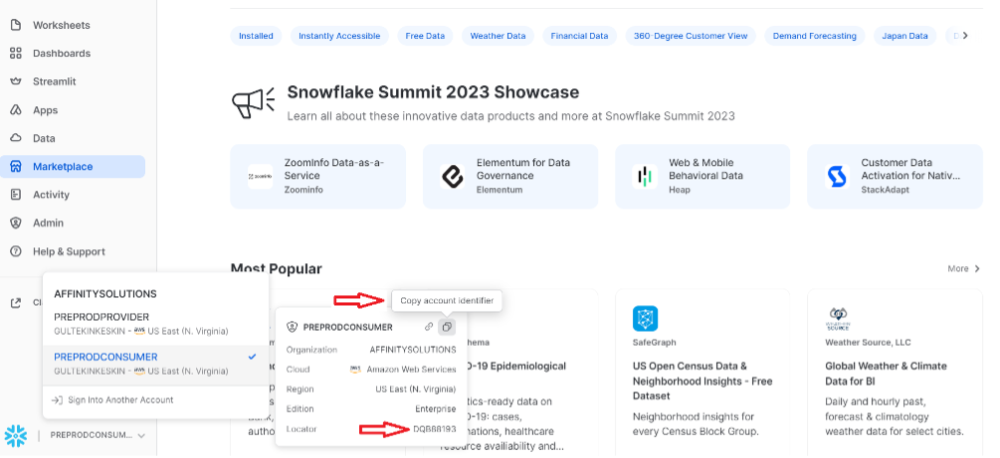
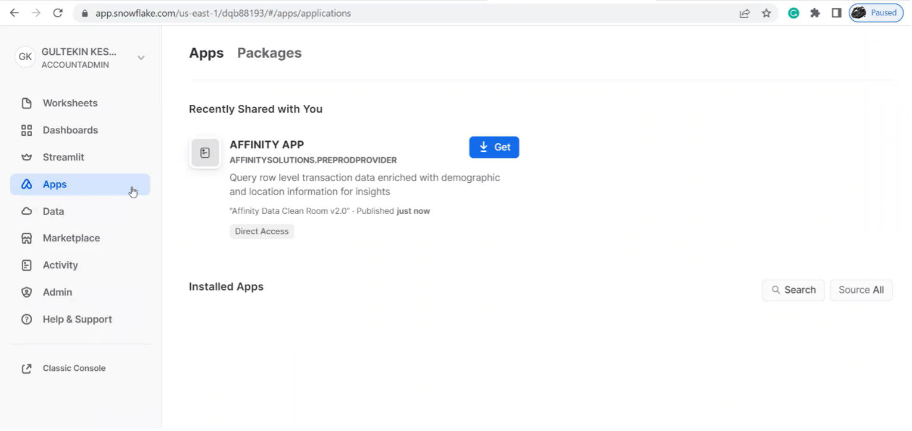
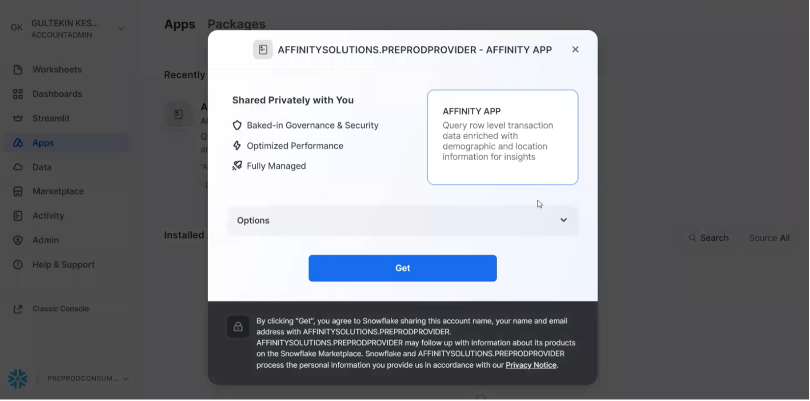
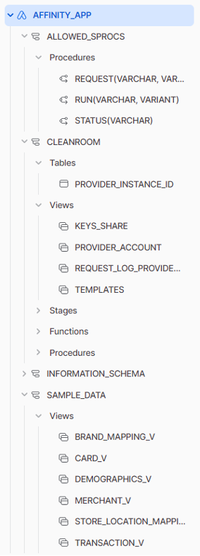
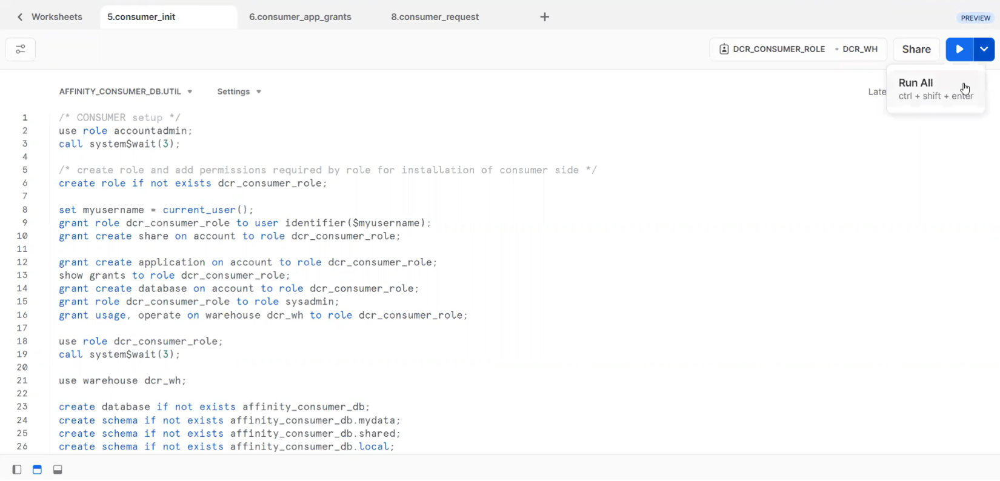
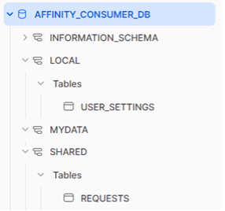

author: Affinity Solutions - Gultekin Keskin, Zachary Horowitz
id: getting_started_with_affinity_solutions
summary: This is guide to installing Affinity Solutions Native App v2 and visualizing consumer purchase data
categories: getting-started,partner-integrations
environments: web
status: Published 
feedback link: https://github.com/Snowflake-Labs/sfguides/issues
tags: Getting Started, Data Science, Data Engineering, Affinity, Affinity Solutions, Consumer Spend, Purchase Behavior 

# Getting Started with Affinity Solutions
<!-- ------------------------ -->
## Overview 
Duration: 1
Affinity Clean Room enables the rapid sharing of real-time data in a way that keeps your personal information hidden. Being able to match our data with yours allows you to see the overlap between data sets. This can be used to identify high-value targets, lapsing customers, and opportunities to win new business.

To set up the Affinity Clean Room, 5 of the 8 steps are performed on the provider side and 3 on the consumer side.

### Prerequisites
- Familiarity with Snowflake's unique DCR architecture
- Working knowledge with Snowflake database objects and the Snowflake Web UI
- Clear understanding of how Snowflake Secure Data Sharing works

### What You’ll Learn
- How to deploy Affinity DCR Native APP in your Snowflake account
- How DCR query requests are initiated, reviewed, approved (or declined) and executed

### What You’ll Need
- Snowflake account -- either Enterprise or Business Critical edition -- that are deployed in the same cloud provider and region (US East -- N. Virginia). 
- Your snowflake account needs to enable for Native App v2 (reach to Snowflake team if not) 

### What You’ll Build 
This Quickstart lab will walk you through the process of deploying a Snowflake v6 DCR environment using Native App v2.
- Provides ability to deploy two-party DCR environments
- Using Jinja SQL templating language tags and logic
- Includes example query template for some common scenario

<!-- ------------------------ -->
## Getting Started
Duration: 2

Note your Account Identifier and Locator

Please share your Account Identifier and Account Locator with us to share Affinity’s private Native App listing with your account.

<!-- ------------------------ -->
## Install Affinity Application
Duration: 2

When we share Affinity’s Native App with your account, you will see the App in your Apps section:

Click Get to download the Application:

When you download the application you will have following objects under the app: 

<!-- ------------------------ -->
## Consumer Initialization
Duration: 2

Now that you've got the application, it's time to prepare the cleanroom consumer side deployment scripts. You can get consumer_init.sql script from our affinity-solutions-data-clean-room-quickstart git repository. 

### When you run the codes, the following has been done and the following objects have been created.
- Create role and add permissions required by role for installation of consumer side.
- Create a request log table to be shared with the provider.
- Create and populate the local settings table.
- Create share to send requests to provider account.
- Grant privileges on consumer side objects to the application database.

USER_SETTINGS: The table contains information about consumer data to be used in templates such as db_name, schema_name, table_name, and join_fields_name.

REQUESTS: Consumer shares this table with Provider, Provider populated the log table using this table. At the same time, security checks are made with this table.

Please contact us to enable your account after you have successfully run consumer_init.sql script.
As Clean room needs to allow two-sided sharing, the whole process has not been automated yet.

<!-- ------------------------ -->
## Images, Videos, and Surveys, and iFrames
Duration: 2

<!-- ------------------------ -->
## Conclusion
Duration: 1

At the end of your Snowflake Guide, always have a clear call to action (CTA). This CTA could be a link to the docs pages, links to videos on youtube, a GitHub repo link, etc. 

If you want to learn more about Snowflake Guide formatting, checkout the official documentation here: [Formatting Guide](https://github.com/googlecodelabs/tools/blob/master/FORMAT-GUIDE.md)

### What we've covered
- creating steps and setting duration
- adding code snippets
- embedding images, videos, and surveys
- importing other markdown files